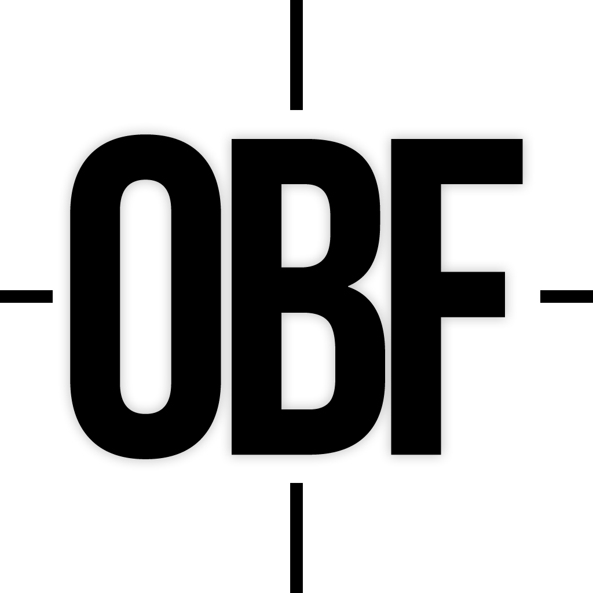

# OpenBF6Tracker

战地风云 6 全平台玩家战绩查询与社区反作弊标记工具。

基于 Next.js 15 构建，对接 [GameTools Network](https://api.gametools.network) API，支持 Origin / Steam / PlayStation / Xbox 四大平台的全方位数据查询。

## 功能特性

### 战绩查询
- 按玩家名称搜索，自动并行探测四大平台（EA / Steam / PSN / Xbox）
- **生涯总览**：击杀、死亡、K/D、KPM、SPM、胜率、总场次、游戏时长等核心数据
- **百分位柱状图**：每项统计显示 P10-P20-P50-P80-P90 分布，悬停查看详细样本
- **武器详情**：各类武器的击杀数、KPM、命中率、爆头率和使用时长
- **载具详情**：各类载具的击杀数、摧毁数、行驶距离
- **兵种分析**：突击兵/工程兵/支援兵/侦察兵的 K/D、KPM、SPM
- **装备统计**：各类装备的击杀和使用次数
- **近战武器**：每把刀的击杀、处决、使用次数
- **模式分析**：各游戏模式的胜场、胜率、K/D、KPM
- **地图统计**：每张地图的胜场和败场

### 赛季分类
- 支持**全面战争**和**禁区冲突**（大逃杀/试炼场）两个大类的独立展示
- 按 **Season 1 / 2 / 3** 拆分每个赛季的数据
- 每个赛季内可分别查看武器、载具、装备、兵种、模式、地图、近战等子分类
- 生涯数据为全部赛季自动聚合，不硬编码赛季号

### 战报系统
- 记录玩家战绩变更历史（增量快照）
- 展开查看该场变更的武器、载具、兵种、模式、地图等详情

### 社区反作弊
- 登录后可对可疑玩家进行**匿名举报**
- 支持 aimbot / wallhack / DMA / macro / recoil / converter / toxic 等多种举报类型
- 举报后在「我的」页面查看自己的举报记录和处理结果
- 管理员可在后台审核标记的可信度（低/中/高）

### 账号与工单
- JWT 令牌认证（jose + bcryptjs）
- 注册只需账号 + 密码
- 登录后可提交工单（问题反馈 / 申请主播认证 / 赞助）
- 「我的」页面查看工单记录和状态

### 赞助系统
- 六级赞助等级：站长 / Tier 1-4 / 协助者
- 不同等级玩家名字显示不同的渐变动画色彩和光晕效果

### 管理后台
- 赞助者管理（添加/删除）
- 留言查看
- 标记审核（可信度评定）
- 主播管理（添加/删除）
- 用户管理（改密 / 封禁 / 设为管理）
- 管理员密码修改

### 服务状态
- 首页显示后端服务和 GameTools API 各节点的实时健康状态

## 技术栈

| 层级 | 技术 |
|------|------|
| **框架** | Next.js 15 (App Router) + React 19 + TypeScript |
| **样式** | Tailwind CSS |
| **数据库** | SQLite (better-sqlite3) |
| **认证** | JWT (jose) + bcryptjs |
| **字体** | Bebas Neue (Google Fonts) |
| **数据源** | [GameTools Network API](https://api.gametools.network) |
| **国际化** | react-i18next (中/英) |

## 项目结构

```
src/
├── app/
│   ├── admin/           # 管理后台页面
│   ├── api/
│   │   ├── admin/       # 管理 API（marks/messages/sponsors/streamers/users/password）
│   │   ├── auth/        # 认证 API（login/logout/me/register）
│   │   ├── contact/     # 联系我们 API
│   │   ├── my/activity/ # 我的活动 API
│   │   ├── profile/     # 玩家档案 API + builder
│   │   ├── search/      # 搜索 API
│   │   ├── suspicion/   # 举报 API
│   │   └── ...
│   ├── contact/         # 联系我们页面
│   ├── my/              # 我的页面
│   ├── player/          # 玩家档案页面
│   └── ...
├── components/
│   ├── PlayerClient.tsx  # 主玩家数据展示组件
│   ├── AuthContext.tsx   # 认证上下文
│   ├── SponsorContext.tsx # 赞助者系统
│   ├── Header.tsx        # 顶部导航
│   ├── Footer.tsx        # 页脚
│   └── ...
└── lib/
    ├── db.ts             # SQLite 数据库层
    ├── gametools.ts      # GameTools API 客户端
    ├── api.ts            # 前端 API 调用
    ├── auth.ts           # JWT 签名/验证
    └── types.ts          # TypeScript 类型定义
```

## 数据库

使用 SQLite 存储，数据库文件自动创建在 `data/bf6.db`。

主要表：
- `profiles` — 玩家档案（TRN 格式完整快照）
- `matches` — 战绩变更增量记录
- `users` — 用户账号
- `sponsors` — 赞助者
- `player_suspicion_reports` — 举报记录
- `contact_messages` — 联系我们工单
- `settings` — 系统配置（管理员密码等）
- `verified_streamers` — 认证主播

## 本地开发

```bash
# 安装依赖
npm install

# 开发模式（支持热更新）
npm run dev

# 生产构建
npm run build
npm start
```

访问 `http://localhost:3000`。

## 环境变量

复制 `.env.example` 为 `.env`：

```bash
cp .env.example .env
```

| 变量 | 说明 | 默认值 |
|------|------|--------|
| `BF6_DB_PATH` | SQLite 数据库路径 | `data/bf6.db` |
| `JWT_SECRET` | JWT 签名密钥（生产环境务必修改） | `bf6-tracker-jwt-secret-dev` |
| `ADMIN_PASSWORD` | 管理后台初始密码 | `admin123` |
| `SUSPICION_HMAC_SECRET` | 举报匿名 HMAC 密钥 | `change-me-in-production` |

## 部署

### Docker / 1Panel

启动命令：`npm run build && npm start`
端口：`3000`

### PM2 手动部署

```bash
npm install
npm run build
pm2 start npm --name "bf6tracker" -- start
pm2 save
```

## API 数据源

所有数据均来自 [GameTools Network 公开 API](https://api.gametools.network/bf6/stats/)。

请求参数：`categories=multiplayer&raw=false&format_values=true&seperation=true&skip_battlelog=true&lang=en-us`

数据经后端的 `buildTrnProfileResponse` 函数转换为 TRN 格式的统一结构。

## 许可证

MIT License

---

Powered by [WANG](https://xnnserver.dpdns.org/)
